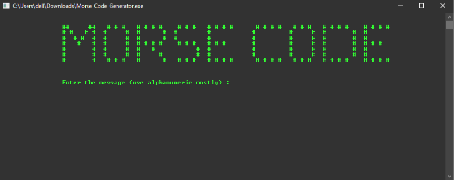

# Morse Code Generator

This C++ project is a Morse Code Generator that allows users to convert English messages to Morse code. Morse code is a method used in telecommunication to encode text characters as standardized sequences of two different signal durations, called dots and dashes or dits and dahs. The International Morse Code encodes the 26 English letters A through Z, some non-English letters, the Arabic numerals and a small set of punctuation and procedural signals (prosigns). There is no distinction between upper and lower case letters. It provides a simple and interactive command-line interface for inputting messages and seeing their Morse code equivalents. The program also supports repeating the conversion for multiple messages.

## Table of Contents
- [Introduction](#introduction)
- [Features](#features)
- [Getting Started](#getting-started)
- [Usage](#usage)
- [Example](#example)
- [License](#license)

## Introduction

The Morse Code Generator is a C++ application that utilizes object-oriented programming concepts to implement the conversion functionality. The program defines a base class called `MorseCodeConverter`, which contains the core logic for converting characters to Morse code. It also provides methods for handling user input, validation, and repeating the conversion process. The project extends the base class to create a specialized class called `MorseCodeEnglishConverter`, which handles English messages.

## Features

- Converts English messages to Morse code.
- Handles both uppercase and lowercase English characters.
- Ignores non-alphabetic characters in the input.
- Allows the user to repeat the conversion process for multiple messages.
- Provides an attractive logo for a visual appeal.

## Getting Started

To run the Morse Code Generator on your local machine, follow these steps:

1. Ensure you have a C++ compiler installed on your system.
2. Clone this GitHub repository to your local machine.
3. Navigate to the project directory containing the source code files.
4. Compile the C++ source files using your C++ compiler.
   ```
   g++ morse_code_generator.cpp -o morse_code_generator
   ```
5. Run the executable file to start the program.
   ```
   ./morse_code_generator
   ```

## Usage

1. The program will display an attractive logo on the screen.
2. Enter the message you want to convert to Morse code. Please use alphanumeric characters and spaces for the best results.
3. The program will display the corresponding Morse code for each character of the message.
4. If you want to convert another message, the program will prompt you to do so.
5. To exit the program, type "No" or "N" when asked if you want to convert another message.

## Preview



## License

This project is licensed under the [MIT License](LICENSE).

Feel free to contribute to this project or use it as a learning resource for C++ and object-oriented programming. Happy coding!
